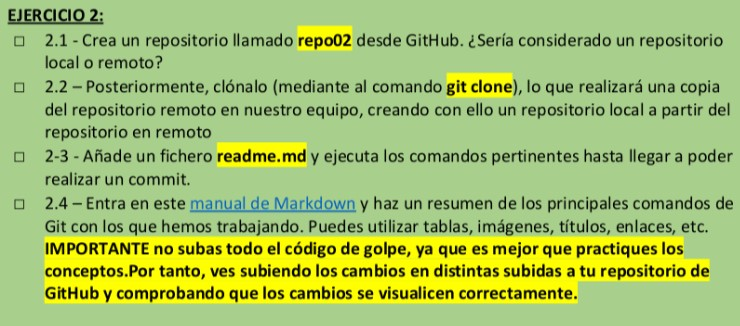
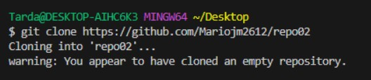
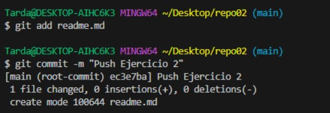

2.1 ➡ Es un repositorio remoto.

2.2 ➡ Procedemos a clonar el repositorio remoto (por ahora está vacío).

2.3 ➡ Añadimos el fichero readme.md y hacemos un commit.

2.4 ➡ Resumen de los principales comandos de GIT

### <u>Setup del repositorio</u>

cd Desktop\ (Nos movemos al escritorio para trabajar mejor)  
mkdir *Repositorio* (Creamos un repositorio)    
cd *Repositorio* (Nos movemos al repositorio)

### <u>Trabajando con la Staging Area</u>

git status (Checkear Work Dir y Stag Area)  
git add . / git add <documento> (Añadir <documento> a Stag Area)  
git rm --cached <documento> (Devolver el <documento> a Work Dir)  
git commit -m "*texto*" (Comitear lo añadido con un mensaje)  
git commit -am "*texto*" (Comitear y añadir)  
git log (Log de commits)  
git log --all --decorate --oneline --graph (Log formato "A DOG")  
git checkout *número de commit* (Moverse a un commit específico)  
git checkout master (Volver a master)  
git checkout master~*número* (Bajar *número* commits desde master)  

### <u>Trabajando con el Repositorio Remoto</u>

git remote -v (Ver servidor)  
git push (Pushear a github)  
git pull (Pullear de github)  
git clone *link* (Clonar repositorio con un link)  
git remote remove origin (Eliminar vinculo entre repo y github)
git branch (Mirar que ramas tengo)  
git branch -d *rama* (Borrar rama)  
git branch *nombre* (Crear rama con cierto nombre)  
git checkout -b *nombre* (Crear rama y moverme)  
git checkout *rama* (Moverse a *rama*)  
git merge --no-f *rama*  (Mergear *rama*)  
git push origin --delete *rama* (Borrar rama del repositorio remoto)
